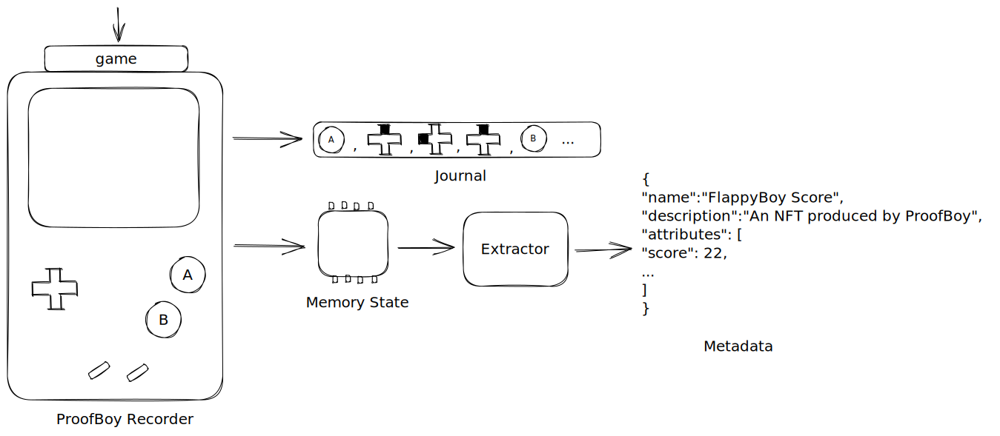
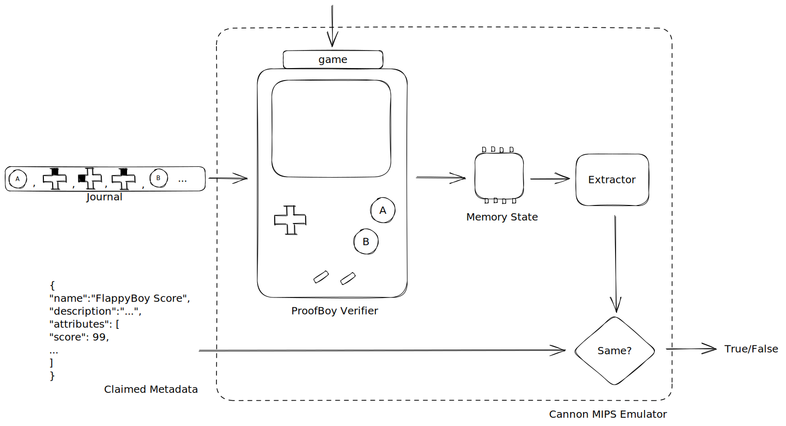

# ProofBoy

[![Contributors][contributors-shield]][contributors-url]
[![Forks][forks-shield]][forks-url]
[![Stargazers][stars-shield]][stars-url]
[![Issues][issues-shield]][issues-url]
[![MIT License][license-shield]][license-url]

> *You got a hight score? Prove it!*

ProofBoy allows for proving state of Gameboy games on-chain using fraud proofs.

Created as an entry to the 2023 Consensys NAV Hackathon.

[Demo hosted here!](https://willemolding.github.io/ProofBoy/). See [Running The Demo](#running-the-demo) below for usage instructions.


<!-- ABOUT THE PROJECT -->
## About The Project

Many blockchain games produce assets such as NFTs to reward players for certain in-game achievements. The common way to verify that players actually did the achievements they claim is to have a game server performing these checks and minting the assets.

This projects takes a step toward enabling fully on-chain gaming by allowing complex game state to be proven on-chain. ProofBoy shows how something as complex as a Gameboy emulator can be verified on-chain using fault proofs.

## On ROMs and Legality

Downloading and playing copyrighted ROMs is piracy. The author of this project does not condone this activity or distribute any copyrighted material as part of the project. All ROMs used in the delp are homebrew and distributed freely under license from the original creators.

Please do not use ProofBoy to play pirated ROMs.

### How it works

#### 1. Recording

Players play a game inside a special emulator called the **ProofBoy Recorder**. This works just like a regular emulator but it keeps track of every key press made by the player and the exact CPU cycle at which it occurred. This record of inputs we call a Journal.

<p align="center">

</p>

This journal can be taken by anyone else and replayed into their own emulator to recreate the exact same Gameboy memory state. ProofBoy also defines something called an Extractor which takes a memory state and maps it into something meaningful. In our example we have an extractor which extracts the players score in FlappyBoy.

Both of these operations are deterministic. Anyone can take a fresh copy of a game and a journal obtain the score the player is reached.

#### 2. Verifying

To verify this on-chain there is a second piece called the **Proofboy Verifier**. This is the same emulator but it operates in headless mode and takes a journal as input. It is built to compile to the MIPS instruction set in a way that is compatible with the [Optimism Cannon fault proving system](https://github.com/ethereum-optimism/optimism/tree/develop/cannon). Cannon was built to verify the Optimism rollup state transition but it can actually be used for any MIPS program including our emulator!

<p align="center">

</p>

Anyone can execute the **Proofboy verifier** off-chain inside the Cannon emulator (emulators within emulators!). If they identify a fraudulent claim (e.g. you claim your journal produces a score that it doesn't) they can challenge it on-chain.

The program itself never fully executed on-chain but if there is a fault in a claim then an honest observer can always show that you are committing fraud. If no one can show your claim is fraudulent for sufficiently long it is assumed to be correct.

#### On-Chain

For the hackathon we implemented a system that allows players to mint an NFT for their high score in the homebrew gameboy game [FlappyBoy](https://github.com/bitnenfer/FlappyBoy). Thanks to ProofBoy, other people can consider this to correspond to a real game state.

<p align="center">

</p>

The flow works as follows:

- Players play the game inside the Proofboy Recorder until the reaching a high score
- They freeze the state which outputs a journal of all their actions and a JSON metadata object describing the score achievement
- The journal and Metadata are submitted along with a bond to a special ERC1155 contract **ERC1155ChallengeableMint**. This allows players to call `ProposeMint` to propose a mint which must remain unchallenged for 2 hours before it can be claimed

From this point two things can occur:

1. The player was honest so no one can challenge their claim. After 2 hours the mint settles they can call `ClaimMint` to receive their NFT and their bond back. This uses the MetaMask SDK to automatically register the minted NFT in the players wallet.

<p align="center">

</p>

2. The player was dishonest. An honest watcher can call `ChallengeMint` to initiate a dispute game. This plays out according to the [Optimism dispute game](https://blog.oplabs.co/building-a-fault-proof-system/) and if the challenge is successful they are awarded the bond and the mint is cancelled

<p align="center">

</p>

Under the assumption that at least one honest watcher is checking any given mint then mints which are allowed to settle can be considered valid. Any invalid mint should be challenged because it is free money for the challenger. These are the same assumptions under which an optimistic rollup operates however since the value secured is much less the settlement period can be reduced from 7 days to a more acceptable few hours.

## Repo Overview

| Component | Description | Doc |
| -------- | -------- | -------- |
| Contracts     | Contains the ERC1155ChallengeableMint contract along with forks of the Optimism dispute game and VM contracts | [](./contracts)  |
| Proofboy Recorder  | A Rust Gameboy emulator which records every key press in a journal. Can be built for desktop or web via WASM. Uses Bevy game engine for Rust | [](./crates/proofboy-recorder/)  |
| Proofboy Verifier Native  | A headless Gameboy emulator which recreates state given a journal. This can be used to check peoples claims are valid. Prefer this over the MIPS version as it is much faster. This can also serve input preimages to the Cannon emulator | [](./crates/proofboy-verifier-cannon/)  |
| Proofboy Verifier Cannon  | Cannon MIPS version of verifier. Builds to a Cannon compatible MIPS binary which reads inputs via a pre-image oracle server (See above) | [](./crates/proofboy-verifier-cannon/)  |
| Client | React web client for ProofBoy. Allows playing games and submitting NFT claims directly from within the browser | [](./client/)  |
| Subgraph | Graph protocol indexer. Allows client to view pending mints along with their metadata | [](./subgraph/)  |
## Technologies Used

ProofBoy uses the following Consensys products:

- [MetaMask SDK](https://metamask.io/sdk/) to obtain account information and allow the player to submit proposals and claims from the browser. It also uses the ['wallet_WatchAsset'](https://docs.metamask.io/wallet/how-to/display/tokens/) feature to allow the minted NFTs to display in the players wallet right away.
- [Infura](https://www.infura.io/) to allow the Rust verifier to retrieve the journal and metadata from a proposal transactions. This makes verifying a claim as simple as proving the transaction hash to the verifier tool.
- [Truffle](https://trufflesuite.com/) as the smart contract development suite
- [Ganache](https://trufflesuite.com/docs/ganache/) for local testing

> ERC1155ChallengeableMint contract deployed on Linea Testnet at: [0x4AaF30D9628Eb89c7a1Feb43aB71eCA2427d1c5c](https://explorer.goerli.linea.build/address/0x4AaF30D9628Eb89c7a1Feb43aB71eCA2427d1c5c/contracts#address-tabs)

Also a special thanks to:

- [Graph Protocol](https://thegraph.com/) Used to index the pending Mints
- [RGY](https://github.com/YushiOMOTE/rgy) A no_std Rust implementation of a Gameboy emulator
- [Bevy Engine](https://bevyengine.org) An excellent Rust game engine which we use to wrap the emulator
- [Cannon-rs](https://github.com/BadBoiLabs/Cannon-rs) A collection of Rust crates and other tools to build Cannon programs in Rust. (Disclaimer this is maintained by me)

<p align="middle" float="left">
  <a href="https://metamask.io">
    
  </a>
  <text>
  <a href="https://www.infura.io/">
    
  </a>
 <text>
  <a href="https://linea.build/">
    
  </a>
  <text>
  <a href="https://thegraph.com/">
    
  </a>
  <text>
  <a href="https://bevyengine.org/">
    
  </a>
  <text>
  <a href="https://github.com/BadBoiLabs/Cannon-rs">
    
  </a>
  <text>
  <a href="https://www.openzeppelin.com/">
    
  </a>
</p>

<!-- GETTING STARTED -->
## Getting Started
### Prerequisites

#### Rustup

Ensure you have [Rustup](https://rustup.rs/) installed so the specific version of Rust required by ProofBoy can be automatically installed.

#### Docker

If you plan to run the graph indexer or build the Proofboy Verifier MIPS binary this will require [Docker](https://www.docker.com/) is installed and running

#### Just

This repo uses `just` instead of `make` for build tasks. Install it with

```shell
cargo install just
```

##### Wasm Pack

```shell
cargo install wasm-pack
```

##### Node

A recent version of Node and NPM is required for building the contracts and client. Tested with v20.

<!-- USAGE EXAMPLES -->
## Usage

### Running the demo

To run the demo you will need a locally running instance of Graph Node. (at least until a public graph indexer for Linea Testnet is available)

1. In one terminal run the following to start a local fresh instance of Graph Node

```shell
cd subgraph
./run-local.sh
```

2. In a separate terminal run the following to build and deploy the subgraph to this node

```shell
cd subgraph
npm install
npm run build
npm run create-local
npm run deploy-local
```

This will add the ProofBoy subgraph to the local running node which is indexing Linea Testnet.

3. Open the demo application

Browse to [https://willemolding.github.io/ProofBoy/](https://willemolding.github.io/ProofBoy/)

This will connect to the local subgraph instance and allow you to see the pending mint proposals.

3. Locally verify a pending mint

- Obtain the transaction hash of a call to `ProposeMint`
- Write a .env file with a RPC_URL value. This can be your infura RPC endpoint for Linea Testnet. See `.env.example`
- run:

```shell
just verify {txn_hash}
```

### Optional Build instructions

#### Build the ProofBoy Recorder WASM module

```shell
just build_web
```

#### Build the contracts

```shell
npm install
npm run build_contracts
```

#### Build and run the client

Must have built the recorder wasm module first.

```shell
cd client
npm install
npm run build
npm run preview
```

## Limitations and Future Work

There are some limits to what ProofBoy can do that should be kept in mind if you plan to use it for your own project.

- Journals need to be submitted in calldata. This is to ensure data availability so anyone can recreate your state. This can get expensive for large journals (for example if you have been playing a game for a long time). Fortunately Linea makes this much cheaper than mainnet. This will reduce significantly if ERC4844 or similar can be used to provided data availability instead.
- Journals are public data. This means another player can easily copy your game state, modify it, and replay it. This means the game reduces to [Tool Assisted Superplay](https://en.wikipedia.org/wiki/Tool-assisted_speedrun) which is still a competitive activity.
- Verifying time is a function of journal size. Again for very long plays the time required to prove may grow too large to complete in the settlement window. Journals longer than a given length should be considered invalid to prevent unbounded execution.
- Optimism's FaultProofGame implementation is still under active development. This forms a core part of the project so any progress in that should be upstreamed.

The ideal solution to all of the above is to use validity proofs (e.g. Snarks or Starks) instead of fraud proofs. The original idea for this project was in fact to do exactly that using [RISCZERO](https://www.risczero.com/) instead of Cannon. Unfortunately that technology is not yet capable of proving such complex programs within a reasonable time (current examples of RISCZERO can prove ~4000 instructions. Our Gameboy emulator requires ~70,000 instructions PER FRAME!!). Hopefully in the future ProofBoy can be remade using validity proofs.

<!-- LICENSE -->
## License

Distributed under the MIT License. See [LICENSE](./LICENSE) for more information.

<!-- CONTACT -->
## Contact

Willem Olding - [@willemolding1](https://twitter.com/willemolding1) - willemolding@gmail.com

Project Link: [https://github.com/willemolding/ProofBoy](https://github.com/willemolding/ProofBoy)

<!-- MARKDOWN LINKS & IMAGES -->
<!-- https://www.markdownguide.org/basic-syntax/#reference-style-links -->
[contributors-shield]: https://img.shields.io/github/contributors/willemolding/ProofBoy.svg?style=for-the-badge
[contributors-url]: https://github.com/willemolding/ProofBoy/graphs/contributors
[forks-shield]: https://img.shields.io/github/forks/willemolding/ProofBoy.svg?style=for-the-badge
[forks-url]: https://github.com/willemolding/ProofBoy/network/members
[stars-shield]: https://img.shields.io/github/stars/willemolding/ProofBoy.svg?style=for-the-badge
[stars-url]: https://github.com/willemolding/ProofBoy/stargazers
[issues-shield]: https://img.shields.io/github/issues/willemolding/ProofBoy.svg?style=for-the-badge
[issues-url]: https://github.com/willemolding/ProofBoy/issues
[license-shield]: https://img.shields.io/github/license/willemolding/ProofBoy.svg?style=for-the-badge
[license-url]: https://github.com/willemolding/ProofBoy/blob/master/LICENSE.txt
